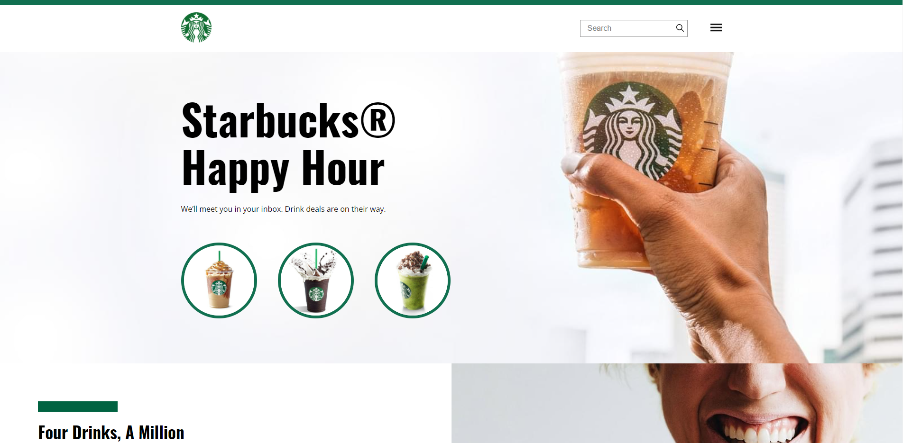
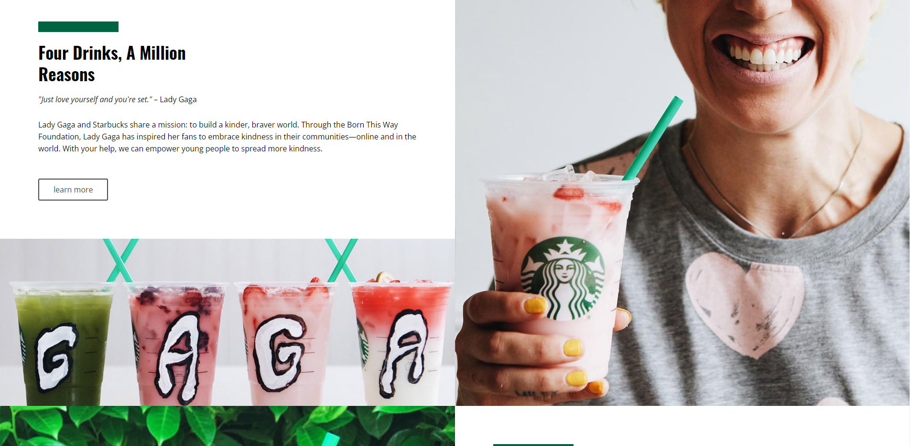
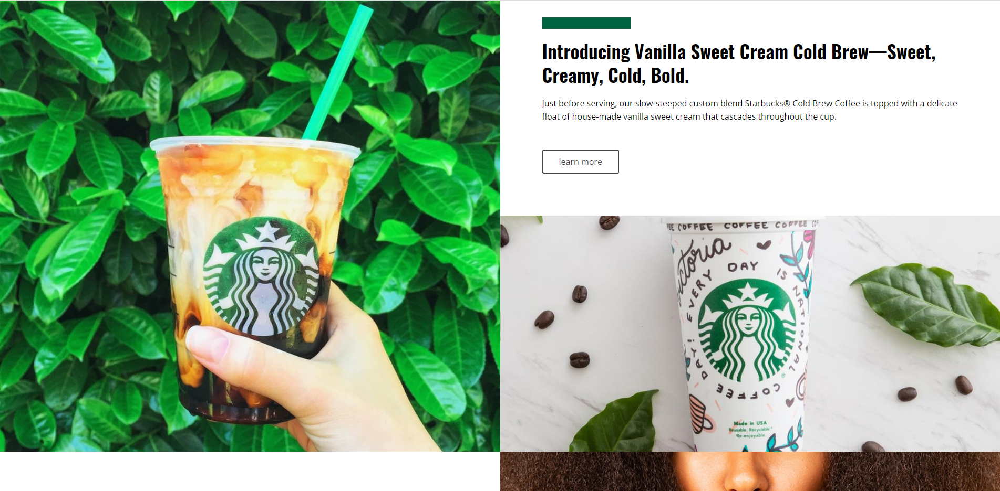
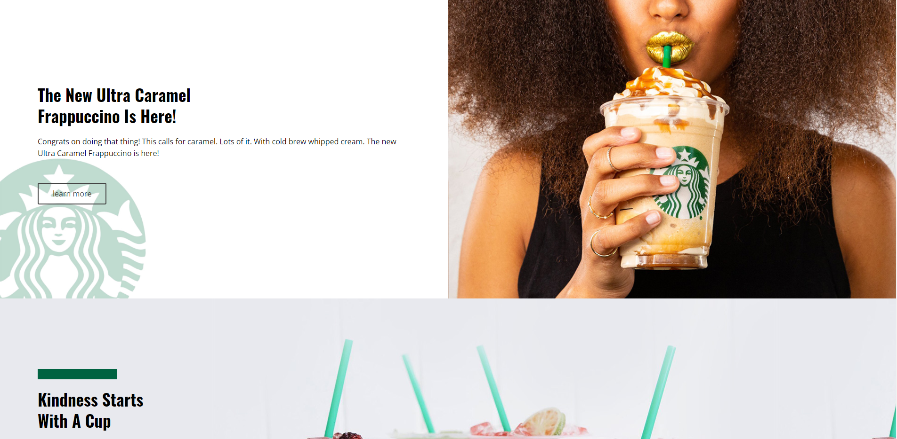
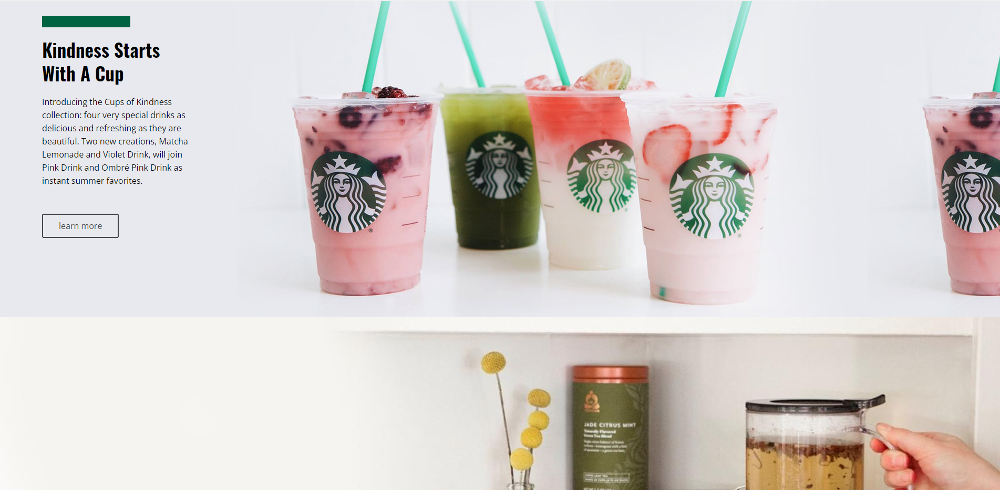

<h1 align="center"> ☕ Projeto clone Starbucks ☕ </h1>

 Projeto desenvolvido no curso b7web - Clone do Starbucks utilizando HTML e CSS!
 

<h3> 📌 Página inicial </h3>

<h3> 📌 Página inicial </h3>

<h3> 📌 Página inicial </h3>

<h3> 📌 Página inicial </h3>

<h3> 📌 Página final </h3>

